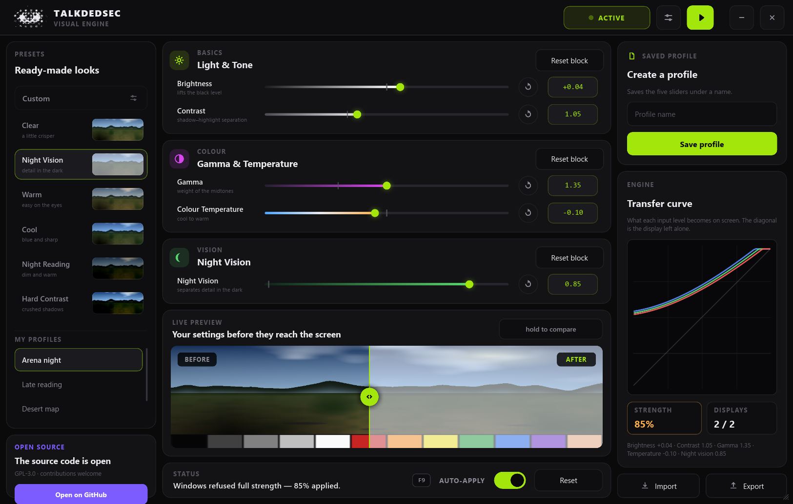

<picture>
  <source media="(prefers-color-scheme: dark)" srcset="assets/banner-dark.png">
  
</picture>

<p align="center">

[](https://github.com/Talkdedsec/tlk-visual/actions/workflows/ci.yml)
[](https://github.com/Talkdedsec/tlk-visual/releases/latest)
[](LICENSE)

</p>

<p align="center">
  <a href="https://github.com/Talkdedsec/tlk-visual/releases/latest"><b>download</b></a>
  &nbsp;·&nbsp;
  <a href="https://talkdedsec.github.io/tlk-visual/#try"><b>try it in the browser</b></a>
  &nbsp;·&nbsp;
  <a href="#build-from-source"><b>build</b></a>
  &nbsp;·&nbsp;
  <a href="#how-it-works"><b>how it works</b></a>
  &nbsp;·&nbsp;
  <a href="README.tr.md"><b>Türkçe</b></a>
</p>

<br>

## What this is

A colour panel for your whole screen. Five sliders — brightness, contrast, gamma, temperature and
night vision — are compiled into a gamma ramp and written straight to the display adapter. Everything
the panel shows goes through it: games, video, the desktop, all of it.

It is not a game mod. Nothing is copied into a game folder, no process is opened, no library is
injected and no driver is installed. The ramp is the same knob a monitor calibration profile turns,
which is why it needs no administrator rights and costs exactly zero frame time — the correction
happens in the display pipeline, not in your game.

<br>

## The panel



Left rail holds the presets; the thumbnails are not screenshots but the same scene pushed through each
preset's actual curve, so what you see on the card is what the preset does. Centre column is the three
control cards. Under them sits a live preview with a draggable before/after split — you set the sliders
there and watch the result before it reaches the screen. **Hold to compare** drops the effect for as
long as the mouse is down.

Right rail saves profiles and draws the transfer curve — what each input level becomes on screen,
against the diagonal of a display left alone. It is one line while the channels agree and splits into
red, green and blue once temperature pulls them apart, redrawn as you drag. Under it, two figures say
what the engine is doing: how much of your setting Windows let through, and on how many displays.
The screenshot above shows the first of them earning its place — Windows turned Night Vision down
to 85%, and the panel says so in amber rather than pretending.

A window shorter than 760 pixels drops the live preview and the source-code card, so the controls,
presets and profiles still fit down to the 680-pixel minimum.

<br>

## Controls

| Control | Range | Neutral | What it does |
|---|---|---|---|
| Brightness | −0.35 … +0.35 | 0.00 | Shifts the whole curve up or down |
| Contrast | 0.60 … 1.80 | 1.00 | Opens the gap between shadow and highlight, pivoting on mid grey |
| Gamma | 0.50 … 2.20 | 1.00 | Reweights the midtones while both ends stay pinned |
| Temperature | −1.00 … +1.00 | 0.00 | Warm or cool, by separating red from blue |
| Night vision | 0.00 … 1.00 | 0.00 | Lifts shadow detail out of the black without washing out highlights |

Every slider carries a tick at its neutral position, and every value box is editable — type `1.35`,
press <kbd>Enter</kbd>, done.

Sliders take the keyboard too: <kbd>←</kbd> <kbd>→</kbd> move by a hundredth of the range,
<kbd>Home</kbd> and <kbd>End</kbd> pin the ends. The mouse wheel moves them in the same steps, and a
double-click puts one back on its neutral tick. Each slider ends exactly where the engine clamps, so
there is no stretch of track at either end that the value snaps back from.

The key next to **Auto-apply** in the status bar is the global shortcut, because that toggle is what it
flips.

Saturation and hue are deliberately absent. A gamma ramp is one curve per channel and cannot mix
channels, so no honest implementation of them exists on this path. Shipping dead sliders would be
worse than leaving them out.

<br>

## How it works

Each of the 256 input levels is pushed through the five stages in a fixed order:

```
night vision → gamma → contrast → brightness → temperature
```

The result is a 256-entry table per channel, handed to `SetDeviceGammaRamp` on every display you
selected.
The maths lives in [`src/color.rs`](src/color.rs) and is held down by unit tests: the neutral setting
must reproduce the identity ramp exactly, every curve must stay monotonic, contrast must pivot on mid
grey, gamma must leave black and white untouched, and night vision must lift shadows at least ten
times more than highlights.

```bash
cargo test
```

### When Windows says no

Windows rejects gamma ramps that stray too far from linear unless `GdiIcmGammaRange` is widened, and
that registry switch needs administrator rights and a sign-out. Rather than fail, the engine walks the
setting down — 100%, 85%, 70% and so on — until the driver accepts one, then tells you in the status
bar exactly how much of your setting survived.

Gamma ramps also outlive the process that set them. The engine reads and stores the ramp of every
display at startup and puts it back on exit, and the restore also runs if the window is closed to the
tray or the effect is toggled off. If a previous run died before it could restore, the ramp it left
behind is recognised at the next start — it matches the saved settings — and cleared instead of being
mistaken for the original.

### When something else resets it

A game entering exclusive fullscreen, a panel waking from sleep and a resolution change all put the
display's ramp back to whatever Windows thinks it should be. The engine reads each display's ramp
once a second and writes the effect again when it has been replaced, so it comes back on its own.

If the ramp keeps getting replaced — five times in twenty seconds — something is fighting for the
display: another colour tool, or a game that drives its own brightness through the ramp. The engine
steps aside for that display rather than flicker against it, and the status bar says so. Changing
any setting takes it back.

<br>

## Install

Windows 10 or 11, 64-bit. Built and tested on Windows 11; the two calls it depends on,
`GetDeviceGammaRamp` and `SetDeviceGammaRamp`, have been in Windows since 2000, so 10 works as far as
the driver allows it.

With [Scoop](https://scoop.sh), which also keeps it updated:

```console
scoop bucket add tlk https://github.com/Talkdedsec/scoop-tlk
scoop install tlk/tlk-visual
```

Or download `talkdedsec-visual.exe` from
[Releases](https://github.com/Talkdedsec/tlk-visual/releases/latest) and run it. One file, no
installer, no .NET, no WebView2, no runtime of any kind. Windows SmartScreen will warn you the first
time because the binary is not code-signed yet; verify the checksum below before choosing
**More info → Run anyway**.

Settings, profiles, the displays you left out and the last slider positions live in one file, written
within a second of any change:

```
%APPDATA%\Talkdedsec\Visual\config.json
```

Delete it and the program starts fresh. Set `TALKDEDSEC_VISUAL_CONFIG` to a path of your own and it
becomes portable. Nothing else is written anywhere, and nothing is sent anywhere — the program opens
no sockets.

### Verify the download

The release workflow builds the binary on a clean GitHub runner and attaches
`talkdedsec-visual.exe.sha256` next to it, so the digest below is the one you can reproduce
from the tag.

SHA-256 for `talkdedsec-visual.exe`, release `v0.1.0`:

```text
8bf76c680ad79587a3536cdaff5dd19763a8a595eb6cac15c6e5bbe4ee074c25
```

```powershell
Get-FileHash .\talkdedsec-visual.exe -Algorithm SHA256
```

<br>

## Living in the tray

Closing the window sends it to the tray rather than quitting, so the effect stays on while you play.
The tray menu shows the window again, toggles the effect, or quits for real. If you would rather the
close button actually close, turn the option off in settings.

A global hotkey — <kbd>F6</kbd> through <kbd>F12</kbd>, <kbd>F9</kbd> by default — toggles the effect
without leaving the game. If another program already owns that key the panel says so instead of
failing silently.

Run at startup is a single registry value under `HKCU\...\CurrentVersion\Run`, added with `--tray` so
it comes up minimised; switching it off removes the value.

Only one copy runs at a time. Starting the program again while it sits in the tray brings the open
window forward instead of putting a second icon next to it.

<br>

## Displays

Settings lists every connected display by the name in its own EDID — `LG ULTRAGEAR`, `DELL U2720Q` —
with a laptop's own panel shown as *Built-in display*. Number 1 is the main display. Click one to
leave it out: its original ramp goes straight back and the effect stays off it, which is how a second
screen or a TV is kept untouched. At least one display always stays selected.

The choice follows the panel rather than the port number Windows hands out, so it survives a reboot.
A display plugged in while the program runs is picked up within a second and gets the effect too,
unless you left it out before.

<br>

## Language

The panel, the tray menu and every status message come in English and Turkish. A first run follows
the Windows display language; pick one in settings and the window switches on the spot, and the
choice is kept in `config.json`. Both languages are compiled into the executable.

Every control also has a name and a role for screen readers and other UI Automation clients: sliders
report their value and range and can be stepped, switches report on or off, and the icon-only buttons
say what they do. <kbd>Esc</kbd> closes the settings.

<br>

## Profiles

Name the current slider positions and they are saved. Saving under a name that already exists
overwrites it, so repeated saves do not pile up duplicates. The profile that matches the sliders is
highlighted, the list scrolls however many you keep, and deleting takes two clicks — the bin turns
into *Delete?* first — so a stray click cannot cost one. Profiles export to plain JSON and import
back, which is also how you move them between machines:

```json
[
  {
    "name": "night",
    "settings": {
      "brightness": 0.04,
      "contrast": 1.05,
      "gamma": 1.35,
      "temperature": -0.1,
      "night_vision": 0.85
    }
  }
]
```

<br>

## Build from source

```bash
git clone https://github.com/Talkdedsec/tlk-visual
cd tlk-visual
cargo build --release
```

Rust 1.85 or newer is the only prerequisite. There is no C++ toolchain step, no Python, no
`node_modules`. The output is `target/release/talkdedsec-visual.exe` at roughly 9.4 MB.

| Path | What is in it |
|---|---|
| `src/color.rs` | The transfer curve and its tests |
| `src/i18n.rs` | Language choice and the Turkish for text drawn from Rust |
| `src/engine.rs` | Displays, gamma ramp I/O, the backoff ladder, the once-a-second watch and restore-on-exit |
| `src/preview.rs` | The procedural preview scene |
| `src/presets.rs` | Built-in presets |
| `src/profiles.rs` | Profile store and JSON import/export |
| `src/system.rs` | Global hotkey, run-at-startup, one copy at a time |
| `ui/` | Slint interface: `main`, `widgets`, `icons`, `theme` |
| `lang/` | Turkish catalog for the Slint interface, bundled at build time |

The preview scene is generated, not photographed: sky gradient, treeline, terrain, a deliberately dark
pocket for night vision to work against, and a twelve-patch calibration strip. Nothing in this
repository is traced from anyone else's artwork.

<br>

## Known limits

- **Saturation and hue are not possible** on a gamma ramp. See above.
- **HDR displays** ignore gamma ramps on most drivers. Turn HDR off if nothing happens.
- **Exclusive fullscreen** hands the display pipeline to the game. A title that resets the ramp on
  entry gets it back within a second; one that keeps rewriting it wins, and the status bar says so.
  Borderless windowed is the reliable mode.
- **The ramp is global.** Every window on that display is affected, not just the game.
- **Every selected display gets the same ramp.** Different settings per display are not possible
  yet, and mixed panels will not land on the same result — the ramp is a curve, not a calibration.
- **Windows clamps the range** by default, so extreme settings arrive softened. The status bar tells
  you when that happened.

<br>

## A note on games

This changes what the display does with the image, not what the game draws. That is a real
distinction, and it is why nothing here touches anti-cheat.

It is not, however, a promise. Some competitive titles disallow external visual settings that improve
visibility, and enforcement is their call rather than a technical question. Read the rules of whatever
you play and decide for yourself.

<br>

## Licence

[GPL-3.0-or-later](LICENSE) — © 2026 Talkdedsec

Take it, change it, ship it. Derivative work has to stay open too.
