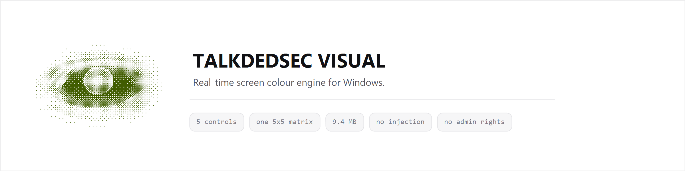
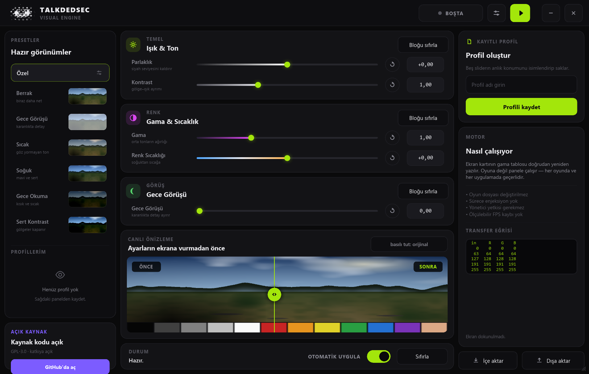

<picture>
  <source media="(prefers-color-scheme: dark)" srcset="assets/banner-dark.png">
  
</picture>

<p align="center">

[](https://github.com/Talkdedsec1/talkdedsec-visual/actions/workflows/ci.yml)
[](https://github.com/Talkdedsec1/talkdedsec-visual/releases/latest)
[](LICENSE)

</p>

<p align="center">
  <a href="https://github.com/Talkdedsec1/talkdedsec-visual/releases/latest"><b>indir</b></a>
  &nbsp;·&nbsp;
  <a href="#kaynaktan-derleme"><b>derle</b></a>
  &nbsp;·&nbsp;
  <a href="#nasıl-çalışıyor"><b>nasıl çalışıyor</b></a>
  &nbsp;·&nbsp;
  <a href="README.md"><b>English</b></a>
</p>

<br>

## Bu ne

Tüm ekran için bir renk paneli. Beş slider — parlaklık, kontrast, gama, renk sıcaklığı ve gece görüşü —
tek bir gama tablosuna derlenip doğrudan ekran kartına yazılıyor. Panelin gösterdiği her şey oradan
geçiyor: oyunlar, video, masaüstü, hepsi.

Bu bir oyun modu değil. Oyun klasörüne dosya kopyalanmıyor, hiçbir sürece bağlanılmıyor, kütüphane
enjekte edilmiyor, sürücü kurulmuyor. Yazılan tablo, monitör kalibrasyon profilinin çevirdiği düğmenin
aynısı. Yönetici yetkisi istememesinin ve kare süresinde tam olarak sıfır maliyeti olmasının sebebi de
bu: düzeltme oyunun içinde değil, ekran hattında oluyor.

<br>

## Panel



Sol rayda presetler duruyor; küçük resimler ekran görüntüsü değil, aynı sahnenin o presetin gerçek
eğrisinden geçirilmiş hali — kartta gördüğün şey presetin yaptığı şey. Orta sütunda üç kontrol kartı.
Altında sürüklenebilir önce/sonra bölmeli canlı önizleme: sliderları orada ayarlayıp sonucu ekrana
ulaşmadan görüyorsun. **Basılı tut: orijinal** düğmesi, basılı tuttuğun sürece efekti kaldırıyor.

Sağ ray profilleri kaydediyor ve transfer eğrisini yazdırıyor: her giriş seviyesinin kırmızı, yeşil ve
mavi kanalda neye dönüştüğünü gösteren beş nokta, sürükledikçe güncelleniyor.

<br>

## Kontroller

| Kontrol | Aralık | Nötr | Ne yapıyor |
|---|---|---|---|
| Parlaklık | −0,35 … +0,35 | 0,00 | Tüm eğriyi yukarı ya da aşağı kaydırıyor |
| Kontrast | 0,60 … 1,80 | 1,00 | Orta griyi merkez alıp gölge–ışık aralığını açıyor |
| Gama | 0,50 … 2,20 | 1,00 | İki uç sabit kalırken orta tonların ağırlığını değiştiriyor |
| Renk Sıcaklığı | −1,00 … +1,00 | 0,00 | Kırmızıyı maviden ayırarak sıcak ya da soğuk yapıyor |
| Gece Görüşü | 0,00 … 1,00 | 0,00 | Parlak alanları patlatmadan gölge detayını karanlıktan çekip çıkarıyor |

Her sliderda nötr konumu gösteren bir çizgi var ve her değer kutusu yazılabilir — `1,35` yaz,
<kbd>Enter</kbd>'a bas, tamam.

Doygunluk ve renk tonu bilerek yok. Gama tablosu kanal başına tek eğri; kanalları birbirine karıştıramaz,
dolayısıyla bu yolda bunların dürüst bir uygulaması mümkün değil. Çalışmayan slider koymaktansa hiç
koymamak daha doğru.

<br>

## Nasıl çalışıyor

256 giriş seviyesinin her biri sabit bir sırayla beş aşamadan geçiyor:

```
gece görüşü → gama → kontrast → parlaklık → renk sıcaklığı
```

Sonuç, kanal başına 256 girişlik bir tablo; bağlı her ekran için `SetDeviceGammaRamp` ile yazılıyor.
Matematik [`src/color.rs`](src/color.rs) içinde ve birim testleriyle bağlı: nötr ayar birim tabloyu
birebir üretmeli, her eğri monoton kalmalı, kontrast orta gri üzerinde dönmeli, gama siyah ve beyaza
dokunmamalı, gece görüşü gölgeleri parlak alanlardan en az on kat fazla kaldırmalı.

```bash
cargo test
```

### Windows hayır dediğinde

Windows, doğrusaldan fazla uzaklaşan gama tablolarını reddediyor; bunu açan `GdiIcmGammaRange` kayıt
değeri ise yönetici yetkisi ve oturum kapatma istiyor. Motor bu durumda hata vermek yerine ayarı
kademeli düşürüyor — %100, %85, %70 diye — sürücü kabul edene kadar, sonra durum çubuğunda ayarının ne
kadarının geçtiğini söylüyor.

Gama tabloları, onu yazan süreç ölse bile ekranda kalıyor. Bu yüzden motor açılışta her ekranın mevcut
tablosunu okuyup saklıyor ve çıkışta geri yazıyor; pencere tepsiye indiğinde ya da efekt kapatıldığında
da aynı geri yükleme çalışıyor.

<br>

## Kurulum

[Releases](https://github.com/Talkdedsec1/talkdedsec-visual/releases/latest) sayfasından
`talkdedsec-visual.exe` dosyasını indir ve çalıştır. Tek dosya; kurulum yok, .NET yok, WebView2 yok,
hiçbir runtime yok. Dosya henüz imzalı olmadığı için Windows SmartScreen ilk seferinde uyarı verecek;
**Ek bilgi → Yine de çalıştır** demeden önce aşağıdaki özeti doğrula.

Ayarlar, profiller ve son slider konumları tek bir dosyada:

```
%APPDATA%\Talkdedsec\Visual\config.json
```

Sil, program sıfırdan açılır. `TALKDEDSEC_VISUAL_CONFIG` değişkenine kendi yolunu verirsen taşınabilir
hale gelir. Başka hiçbir yere bir şey yazılmıyor ve hiçbir yere bir şey gönderilmiyor — program hiç
soket açmıyor.

### İndirmeyi doğrula

`talkdedsec-visual.exe` için SHA-256, `v0.1.0` sürümü:

```text
19850de3a7c3e765275da14abc44b46db2a4cba2aebbd5801077198026e481ec
```

```powershell
Get-FileHash .\talkdedsec-visual.exe -Algorithm SHA256
```

<br>

## Tepside yaşamak

Pencereyi kapatmak programı sonlandırmıyor, tepsiye indiriyor — böylece oynarken efekt açık kalıyor.
Tepsi menüsü pencereyi geri getiriyor, efekti açıp kapatıyor ya da programı gerçekten kapatıyor.
Çarpı tuşunun gerçekten kapatmasını istersen ayarlardan kapatabilirsin.

Global kısayol — <kbd>F6</kbd>–<kbd>F12</kbd> arası, varsayılan <kbd>F9</kbd> — oyundan çıkmadan efekti
açıp kapatıyor. Tuş başka bir program tarafından kullanılıyorsa panel sessizce başarısız olmak yerine
bunu söylüyor.

Windows açılışında başlatma, `HKCU\...\CurrentVersion\Run` altında tek bir kayıt değeri; tepsiye
küçültülmüş gelsin diye `--tray` ile ekleniyor, kapatınca değer siliniyor.

<br>

## Profiller

Anlık slider konumlarını isimlendirdiğinde kaydediliyor. Var olan bir isme kaydetmek üzerine yazıyor,
yani tekrar tekrar kaydetmek kopya yığmıyor. Profiller düz JSON olarak dışa aktarılıp geri alınabiliyor;
makineler arası taşımanın yolu da bu:

```json
[
  {
    "name": "gece",
    "settings": {
      "brightness": 0.04,
      "contrast": 1.05,
      "gamma": 1.35,
      "temperature": -0.1,
      "night_vision": 0.85
    }
  }
]
```

<br>

## Kaynaktan derleme

```bash
git clone https://github.com/Talkdedsec1/talkdedsec-visual
cd talkdedsec-visual
cargo build --release
```

Tek gereksinim Rust 1.85 ve üzeri. C++ toolchain adımı yok, Python yok, `node_modules` yok.
Çıktı `target/release/talkdedsec-visual.exe`, yaklaşık 9,4 MB.

| Yol | İçinde ne var |
|---|---|
| `src/color.rs` | Transfer eğrisi ve testleri |
| `src/engine.rs` | Gama tablosu okuma/yazma, kademeli geri çekilme, çıkışta geri yükleme |
| `src/preview.rs` | Prosedürel önizleme sahnesi |
| `src/presets.rs` | Hazır presetler |
| `src/profiles.rs` | Profil deposu ve JSON içe/dışa aktarma |
| `src/system.rs` | Tepsi, global kısayol, açılışta başlatma |
| `ui/` | Slint arayüzü: `main`, `widgets`, `icons`, `theme` |

Önizleme sahnesi çekilmiş değil, üretilmiş: gökyüzü geçişi, ağaç hattı, arazi, gece görüşünün üzerinde
çalışabileceği bilinçli olarak karanlık bir cep ve on iki kareli kalibrasyon şeridi. Bu depoda kimsenin
görselinden izlenmiş hiçbir şey yok.

<br>

## Bilinen sınırlar

- **Doygunluk ve renk tonu gama tablosuyla mümkün değil.** Yukarıda anlattım.
- **HDR ekranlarda** çoğu sürücü gama tablosunu yok sayıyor. Hiçbir şey olmuyorsa HDR'ı kapat.
- **Exclusive fullscreen** ekran hattını oyuna devrediyor; bazı oyunlar girişte tabloyu sıfırlıyor.
  Güvenilir mod borderless (kenarlıksız pencere).
- **Tablo ekranın tamamına uygulanıyor.** Sadece oyun değil, o ekrandaki her pencere etkileniyor.
- **Windows aralığı varsayılan olarak kısıtlıyor,** yani uç ayarlar yumuşatılmış geliyor. Durum çubuğu
  bunu olduğunda söylüyor.

<br>

## Oyunlar hakkında

Bu araç ekranın görüntüyle ne yaptığını değiştiriyor, oyunun ne çizdiğini değil. Bu gerçek bir ayrım ve
buradaki hiçbir şeyin anti-cheat'e dokunmamasının sebebi de bu.

Ama bir garanti değil. Bazı rekabetçi oyunlar görüşü iyileştiren harici görüntü ayarlarına izin vermiyor
ve bu teknik bir soru değil, onların kararı. Oynadığın oyunun kurallarını oku ve kendin karar ver.

<br>

## Lisans

[GPL-3.0-or-later](LICENSE) — © 2026 Talkdedsec

Al, değiştir, dağıt. Türev iş de açık kalmak zorunda.
