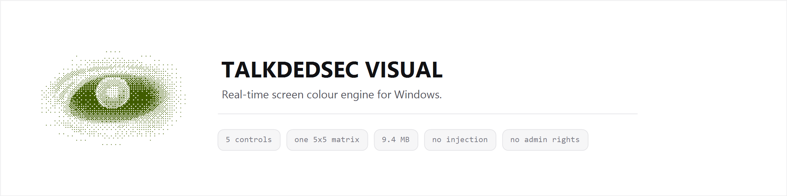
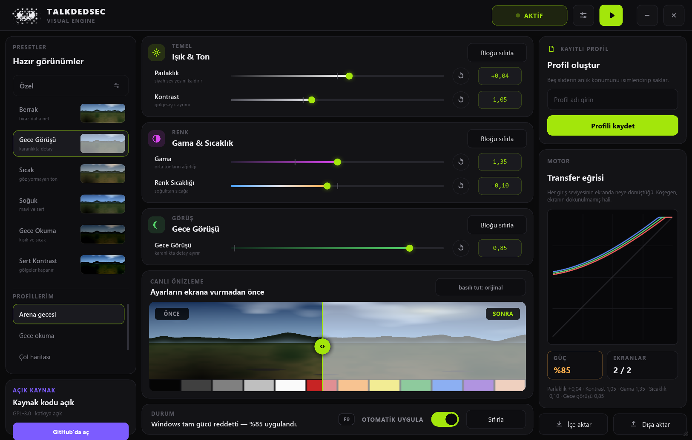

<picture>
  <source media="(prefers-color-scheme: dark)" srcset="assets/banner-dark.png">
  
</picture>

<p align="center">

[](https://github.com/Talkdedsec/tlk-visual/actions/workflows/ci.yml)
[](https://github.com/Talkdedsec/tlk-visual/releases/latest)
[](LICENSE)

</p>

<p align="center">
  <a href="https://github.com/Talkdedsec/tlk-visual/releases/latest"><b>indir</b></a>
  &nbsp;·&nbsp;
  <a href="https://talkdedsec.github.io/tlk-visual/#try"><b>tarayıcıda dene</b></a>
  &nbsp;·&nbsp;
  <a href="#kaynaktan-derleme"><b>derle</b></a>
  &nbsp;·&nbsp;
  <a href="#nasıl-çalışıyor"><b>nasıl çalışıyor</b></a>
  &nbsp;·&nbsp;
  <a href="README.md"><b>English</b></a>
</p>

<br>

## Bu ne

Tüm ekran için bir renk paneli. Beş slider — parlaklık, kontrast, gama, renk sıcaklığı ve gece görüşü —
tek bir gama tablosuna derlenip doğrudan ekran kartına yazılıyor. Panelin gösterdiği her şey oradan
geçiyor: oyunlar, video, masaüstü, hepsi.

Bu bir oyun modu değil. Oyun klasörüne dosya kopyalanmıyor, hiçbir sürece bağlanılmıyor, kütüphane
enjekte edilmiyor, sürücü kurulmuyor. Yazılan tablo, monitör kalibrasyon profilinin çevirdiği düğmenin
aynısı. Yönetici yetkisi istememesinin ve kare süresinde tam olarak sıfır maliyeti olmasının sebebi de
bu: düzeltme oyunun içinde değil, ekran hattında oluyor.

<br>

## Panel



Sol rayda presetler duruyor; küçük resimler ekran görüntüsü değil, aynı sahnenin o presetin gerçek
eğrisinden geçirilmiş hali — kartta gördüğün şey presetin yaptığı şey. Orta sütunda üç kontrol kartı.
Altında sürüklenebilir önce/sonra bölmeli canlı önizleme: sliderları orada ayarlayıp sonucu ekrana
ulaşmadan görüyorsun. **Basılı tut: orijinal** düğmesi, basılı tuttuğun sürece efekti kaldırıyor.

Sağ ray profilleri kaydediyor ve transfer eğrisini çiziyor — her giriş seviyesinin ekranda neye
dönüştüğü, dokunulmamış ekranın köşegeniyle yan yana. Kanallar aynıyken tek çizgi; renk sıcaklığı
onları ayırınca kırmızı, yeşil ve mavi olarak üçe ayrılıyor, sürükledikçe yeniden çiziliyor. Altında
iki rakam motorun ne yaptığını söylüyor: ayarının ne kadarını Windows'un geçirdiği ve kaç ekranda.
Yukarıdaki görüntüde ilki işini yapıyor — Windows Gece Görüşü'nü %85'e indirdi, panel de bunu
saklamak yerine turuncuyla söylüyor.

760 pikselden kısa bir pencerede canlı önizleme ve kaynak kodu kartı gizleniyor; böylece 680
piksellik en küçük boyutta bile kontroller, presetler ve profiller sığıyor.

<br>

## Kontroller

| Kontrol | Aralık | Nötr | Ne yapıyor |
|---|---|---|---|
| Parlaklık | −0,35 … +0,35 | 0,00 | Tüm eğriyi yukarı ya da aşağı kaydırıyor |
| Kontrast | 0,60 … 1,80 | 1,00 | Orta griyi merkez alıp gölge–ışık aralığını açıyor |
| Gama | 0,50 … 2,20 | 1,00 | İki uç sabit kalırken orta tonların ağırlığını değiştiriyor |
| Renk Sıcaklığı | −1,00 … +1,00 | 0,00 | Kırmızıyı maviden ayırarak sıcak ya da soğuk yapıyor |
| Gece Görüşü | 0,00 … 1,00 | 0,00 | Parlak alanları patlatmadan gölge detayını karanlıktan çekip çıkarıyor |

Her sliderda nötr konumu gösteren bir çizgi var ve her değer kutusu yazılabilir — `1,35` yaz,
<kbd>Enter</kbd>'a bas, tamam.

Sliderlar klavyeyi de dinliyor: <kbd>←</kbd> <kbd>→</kbd> aralığın yüzde birini kaydırıyor,
<kbd>Home</kbd> ve <kbd>End</kbd> uçlara götürüyor. Fare tekerleği aynı adımlarla oynatıyor, çift tık
slideri nötr çizgisine geri koyuyor. Her slider tam olarak motorun kırptığı yerde bitiyor; yani
iki ucunda değerin geri zıpladığı ölü bir bölge yok.

Durum çubuğunda **Otomatik uygula**'nın yanındaki tuş global kısayol; çünkü kısayolun açıp kapattığı
şey tam olarak o anahtar.

Doygunluk ve renk tonu bilerek yok. Gama tablosu kanal başına tek eğri; kanalları birbirine karıştıramaz,
dolayısıyla bu yolda bunların dürüst bir uygulaması mümkün değil. Çalışmayan slider koymaktansa hiç
koymamak daha doğru.

<br>

## Nasıl çalışıyor

256 giriş seviyesinin her biri sabit bir sırayla beş aşamadan geçiyor:

```
gece görüşü → gama → kontrast → parlaklık → renk sıcaklığı
```

Sonuç, kanal başına 256 girişlik bir tablo; seçtiğin her ekran için `SetDeviceGammaRamp` ile yazılıyor.
Matematik [`src/color.rs`](src/color.rs) içinde ve birim testleriyle bağlı: nötr ayar birim tabloyu
birebir üretmeli, her eğri monoton kalmalı, kontrast orta gri üzerinde dönmeli, gama siyah ve beyaza
dokunmamalı, gece görüşü gölgeleri parlak alanlardan en az on kat fazla kaldırmalı.

```bash
cargo test
```

### Windows hayır dediğinde

Windows, doğrusaldan fazla uzaklaşan gama tablolarını reddediyor; bunu açan `GdiIcmGammaRange` kayıt
değeri ise yönetici yetkisi ve oturum kapatma istiyor. Motor bu durumda hata vermek yerine ayarı
kademeli düşürüyor — %100, %85, %70 diye — sürücü kabul edene kadar, sonra durum çubuğunda ayarının ne
kadarının geçtiğini söylüyor.

Gama tabloları, onu yazan süreç ölse bile ekranda kalıyor. Bu yüzden motor açılışta her ekranın mevcut
tablosunu okuyup saklıyor ve çıkışta geri yazıyor; pencere tepsiye indiğinde ya da efekt kapatıldığında
da aynı geri yükleme çalışıyor. Önceki çalışma geri yükleyemeden öldüyse, geride bıraktığı tablo bir
sonraki açılışta tanınıyor — kayıtlı ayarlarla eşleşiyor — ve orijinal sanılmak yerine temizleniyor.

### Başka bir şey sıfırladığında

Exclusive fullscreen'e giren bir oyun, uykudan uyanan bir ekran ve çözünürlük değişikliği, ekranın
tablosunu Windows'un doğru bildiği hale geri çekiyor. Motor her ekranın tablosunu saniyede bir okuyor ve
yerine başka bir şey yazılmışsa efekti yeniden yazıyor; yani efekt kendiliğinden geri geliyor.

Tablo sürekli değiştiriliyorsa — yirmi saniyede beş kez — biri ekran için kavga ediyor demektir: başka
bir renk aracı ya da parlaklığını tablo üzerinden yöneten bir oyun. Motor o ekranda titreştirerek karşılık
vermek yerine kenara çekiliyor ve durum çubuğunda bunu söylüyor. Herhangi bir ayarı değiştirmek ekranı
geri alıyor.

<br>

## Kurulum

Windows 10 ya da 11, 64-bit. Windows 11'de derlenip test edildi; dayandığı iki çağrı,
`GetDeviceGammaRamp` ve `SetDeviceGammaRamp`, 2000'den beri Windows'ta olduğu için sürücünün izin
verdiği ölçüde 10'da da çalışır.

[Scoop](https://scoop.sh) ile — güncellemeleri de kendi getirir:

```console
scoop bucket add tlk https://github.com/Talkdedsec/scoop-tlk
scoop install tlk/tlk-visual
```

Ya da [Releases](https://github.com/Talkdedsec/tlk-visual/releases/latest) sayfasından
`talkdedsec-visual.exe` dosyasını indir ve çalıştır. Tek dosya; kurulum yok, .NET yok, WebView2 yok,
hiçbir runtime yok. Dosya henüz imzalı olmadığı için Windows SmartScreen ilk seferinde uyarı verecek;
**Ek bilgi → Yine de çalıştır** demeden önce aşağıdaki özeti doğrula.

Ayarlar, profiller, dışarıda bıraktığın ekranlar ve son slider konumları tek bir dosyada; her
değişiklikten sonra bir saniye içinde yazılıyor:

```
%APPDATA%\Talkdedsec\Visual\config.json
```

Sil, program sıfırdan açılır. `TALKDEDSEC_VISUAL_CONFIG` değişkenine kendi yolunu verirsen taşınabilir
hale gelir. Başka hiçbir yere bir şey yazılmıyor ve hiçbir yere bir şey gönderilmiyor — program hiç
soket açmıyor.

### İndirmeyi doğrula

Release iş akışı ikiliyi temiz bir GitHub makinesinde derliyor ve yanına
`talkdedsec-visual.exe.sha256` dosyasını koyuyor; aşağıdaki özet etiketten yeniden
üretebileceğin özet.

`talkdedsec-visual.exe` için SHA-256, `v0.2.0` sürümü:

```text
3c8d157281093a52c03caee9cfcfa36a466057d6280392ea305f8b8ef8841c7f
```

```powershell
Get-FileHash .\talkdedsec-visual.exe -Algorithm SHA256
```

<br>

## Tepside yaşamak

Pencereyi kapatmak programı sonlandırmıyor, tepsiye indiriyor — böylece oynarken efekt açık kalıyor.
Tepsi menüsü pencereyi geri getiriyor, efekti açıp kapatıyor ya da programı gerçekten kapatıyor.
Çarpı tuşunun gerçekten kapatmasını istersen ayarlardan kapatabilirsin.

Global kısayol — <kbd>F6</kbd>–<kbd>F12</kbd> arası, varsayılan <kbd>F9</kbd> — oyundan çıkmadan efekti
açıp kapatıyor. Tuş başka bir program tarafından kullanılıyorsa panel sessizce başarısız olmak yerine
bunu söylüyor.

Windows açılışında başlatma, `HKCU\...\CurrentVersion\Run` altında tek bir kayıt değeri; tepsiye
küçültülmüş gelsin diye `--tray` ile ekleniyor, kapatınca değer siliniyor.

Aynı anda tek kopya çalışıyor. Program tepside dururken yeniden başlatılırsa, yanına ikinci bir ikon
koymak yerine açık olan pencereyi öne getiriyor.

<br>

## Ekranlar

Ayarlar, bağlı her ekranı kendi EDID'sinde yazan adla listeliyor — `LG ULTRAGEAR`, `DELL U2720Q` —
dizüstünün kendi paneli *Dahili ekran* olarak görünüyor. 1 numara ana ekran. Birine tıklayınca
dışarıda kalıyor: orijinal tablosu hemen geri yazılıyor ve efekt ona uğramıyor; ikinci ekranı ya da
televizyonu dokunulmamış tutmanın yolu bu. En az bir ekran her zaman seçili kalıyor.

Seçim, Windows'un dağıttığı port numarasını değil paneli izliyor, yani yeniden başlatmadan sonra da
geçerli. Program çalışırken takılan bir ekran bir saniye içinde yakalanıyor ve — daha önce dışarıda
bırakmadıysan — efekti o da alıyor.

<br>

## Dil

Panel, tepsi menüsü ve bütün durum mesajları İngilizce ve Türkçe. İlk açılışta Windows'un görüntü
dilini izliyor; ayarlardan birini seçtiğinde pencere anında değişiyor ve seçim `config.json` dosyasında
saklanıyor. İki dil de exe'nin içine derleniyor.

Her kontrolün ekran okuyucular ve diğer UI Automation istemcileri için bir adı ve rolü de var:
sliderlar değerini ve aralığını bildiriyor ve adım adım oynatılabiliyor, anahtarlar açık/kapalı
olduğunu söylüyor, sadece ikonlu düğmeler ne yaptığını söylüyor. <kbd>Esc</kbd> ayarları kapatıyor.

<br>

## Profiller

Anlık slider konumlarını isimlendirdiğinde kaydediliyor. Var olan bir isme kaydetmek üzerine yazıyor,
yani tekrar tekrar kaydetmek kopya yığmıyor. Sliderlarla eşleşen profil vurgulanıyor, liste kaç
profil tutarsan tut kayıyor ve silmek iki tık istiyor — çöp kutusu önce *Sil?* oluyor — yani yanlış bir
tık profil kaybettirmiyor. Profiller düz JSON olarak dışa aktarılıp geri alınabiliyor; makineler arası
taşımanın yolu da bu:

```json
[
  {
    "name": "gece",
    "settings": {
      "brightness": 0.04,
      "contrast": 1.05,
      "gamma": 1.35,
      "temperature": -0.1,
      "night_vision": 0.85
    }
  }
]
```

<br>

## Kaynaktan derleme

```bash
git clone https://github.com/Talkdedsec/tlk-visual
cd tlk-visual
cargo build --release
```

Tek gereksinim Rust 1.85 ve üzeri. C++ toolchain adımı yok, Python yok, `node_modules` yok.
Çıktı `target/release/talkdedsec-visual.exe`, yaklaşık 9,4 MB.

| Yol | İçinde ne var |
|---|---|
| `src/color.rs` | Transfer eğrisi ve testleri |
| `src/i18n.rs` | Dil seçimi ve Rust tarafında çizilen metinlerin Türkçesi |
| `src/engine.rs` | Ekranlar, gama tablosu okuma/yazma, kademeli geri çekilme, saniyelik nöbet, çıkışta geri yükleme |
| `src/preview.rs` | Prosedürel önizleme sahnesi |
| `src/presets.rs` | Hazır presetler |
| `src/profiles.rs` | Profil deposu ve JSON içe/dışa aktarma |
| `src/system.rs` | Global kısayol, açılışta başlatma, tek kopya |
| `ui/` | Slint arayüzü: `main`, `widgets`, `icons`, `theme` |
| `lang/` | Slint arayüzünün Türkçe kataloğu, derleme sırasında exe'ye gömülüyor |

Önizleme sahnesi çekilmiş değil, üretilmiş: gökyüzü geçişi, ağaç hattı, arazi, gece görüşünün üzerinde
çalışabileceği bilinçli olarak karanlık bir cep ve on iki kareli kalibrasyon şeridi. Bu depoda kimsenin
görselinden izlenmiş hiçbir şey yok.

<br>

## Bilinen sınırlar

- **Doygunluk ve renk tonu gama tablosuyla mümkün değil.** Yukarıda anlattım.
- **HDR ekranlarda** çoğu sürücü gama tablosunu yok sayıyor. Hiçbir şey olmuyorsa HDR'ı kapat.
- **Exclusive fullscreen** ekran hattını oyuna devrediyor. Girişte tabloyu sıfırlayan oyun onu bir
  saniye içinde geri alıyor; sürekli yeniden yazan oyun kazanıyor, durum çubuğu da bunu söylüyor.
  Güvenilir mod borderless (kenarlıksız pencere).
- **Tablo ekranın tamamına uygulanıyor.** Sadece oyun değil, o ekrandaki her pencere etkileniyor.
- **Seçili her ekran aynı tabloyu alıyor.** Ekran başına farklı ayar henüz yok; farklı paneller aynı
  sonuca da varmıyor — bu bir eğri, kalibrasyon değil.
- **Windows aralığı varsayılan olarak kısıtlıyor,** yani uç ayarlar yumuşatılmış geliyor. Durum çubuğu
  bunu olduğunda söylüyor.

<br>

## Oyunlar hakkında

Bu araç ekranın görüntüyle ne yaptığını değiştiriyor, oyunun ne çizdiğini değil. Bu gerçek bir ayrım ve
buradaki hiçbir şeyin anti-cheat'e dokunmamasının sebebi de bu.

Ama bir garanti değil. Bazı rekabetçi oyunlar görüşü iyileştiren harici görüntü ayarlarına izin vermiyor
ve bu teknik bir soru değil, onların kararı. Oynadığın oyunun kurallarını oku ve kendin karar ver.

<br>

## Lisans

[GPL-3.0-or-later](LICENSE) — © 2026 Talkdedsec

Al, değiştir, dağıt. Türev iş de açık kalmak zorunda.
